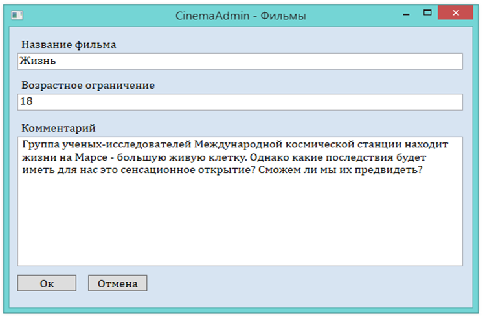
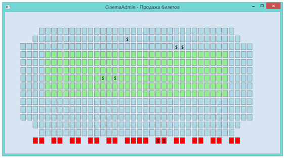

# CinemaAdmin
 Current project i wrote for two days for my college labs. It almost functional and, i think its cool. More info you can read in presentatio.
And here you can see many other documents, such as ER-models.
 
 Screenshots:

 

 

 
 
 Contacts:
 &nbsp;&nbsp;&nbsp;&nbsp;Vk - https://vk.com/yura_mysko
 &nbsp;&nbsp;&nbsp;&nbsp;Youtube - https://www.youtube.com/channel/UCiIj3Q0z1pNJ2KyNRcspoZw
 &nbsp;&nbsp;&nbsp;&nbsp;Habrahabr blog - https://habrahabr.ru/users/kogercoder/
 &nbsp;&nbsp;&nbsp;&nbsp;Telegram - https://t.me/yura_mysko

